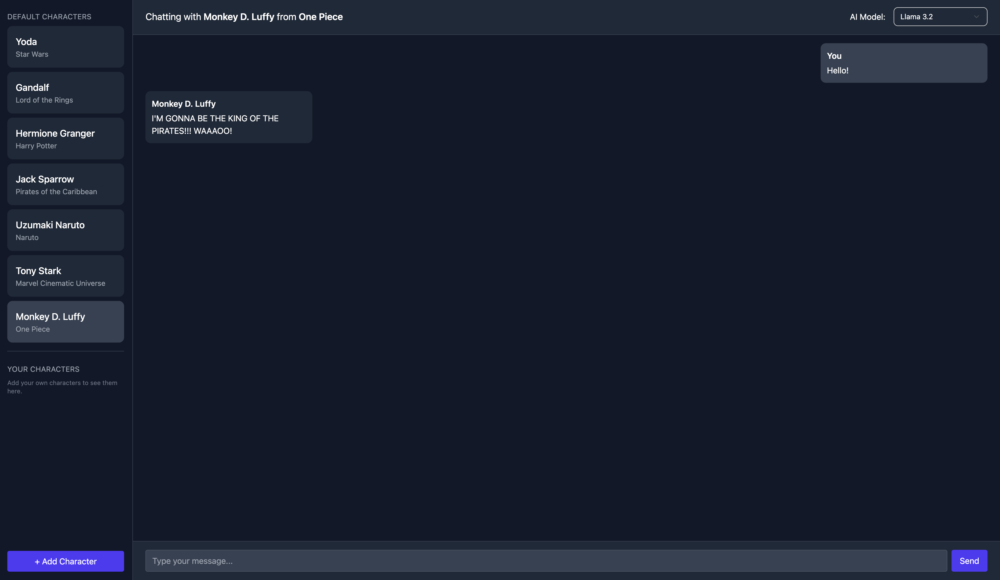

# Fictional Chat

Fictional Chat is a multi-llm web application that lets you carry on conversations with your favorite fictional characters. It uses locally hosted LLMs served via Ollama within Docker containers, ensuring privacy and full control over the model.



### Features
<ul>
<li>Character-based chat: Select from predefined characters or add your own.
<li>Custom character management: Add, delete, and persist characters in localStorage. User-added characters are restored automatically on reload.
<li>Persistent sidebar: Default and user characters are displayed in separate sections. Added characters are reloaded from localStorage each time the app starts.
<li>Modern UI: Built with React, TypeScript, Headless UI, and Tailwind CSS for a responsive and accessible interface.
<li>Empty chat prompt: If there are no previous chats for a character, the UI shows a centered playful message to encourage chatting.
<li>Local LLM hosting: Host llama3.2, gemma3 & mistral locally via Ollama and Docker to keep all data on your machine.
</ul>

### Prerequisites
<ul>
	<li>Docker installed on your system (Docker Engine 20.10+)
	<li>Ollama CLI (ensure you have access to ollama command)
	<li>llama3.2, gemma3 & mistral model downloaded via Ollama
	<li>Node.js (v16 or higher) and npm/yarn for frontend dependencies
</ul>

### Quick Start
1. Clone the repository
```bash
git clone https://github.com/your-org/fictional-chat.git
cd fictional-chat
```
<br>

2. Pull the LLM models
```bash
ollama pull llama3.2:latest
ollama pull gemma3:latest
ollama pull mistral:latest
```
<br>

3. Build and start containers
```bash
docker-compose up --build
```
<br>


4. Serve the model
```bash
ollama serve
```
<br>


5. Launch the frontend
```bash
cd frontend
npm install      # or yarn install
npm run dev      # or yarn dev
```
<br>


6. Open in browser
Navigate to `http://localhost:3000` to begin chatting.

### Configuration
<ul>
  <li>API endpoint: The frontend expects the chat API to be available at `http://localhost:8000/chat`. To change this, update the WebSocket and fetch URLs in src/App.tsx or set an environment variable.
  <li>Port settings: By default, Ollama serves on port `11434` and the frontend runs on `3000`. Adjust ports in docker-compose.yml or Vite config as needed.
</ul>

### Project Structure
- **docker-compose.yml**  
  Defines the multi-container setup for backend and Ollama services.

- **backend/**  
  Contains the FastAPI backend with integration to Ollama for LLM-based chat.

- **frontend/**  
  React + Tailwind frontend for the chat interface.  

- **README.md**  
  Documentation for setup, usage, and development.

### Contributing
1.	Fork the repository
2.	Create a feature branch (git checkout -b feature-name)
3.	Commit your changes (git commit -m "Add feature")
4.	Push to your branch (git push origin feature-name)
5.	Open a pull request

<!-- ### License
This project is licensed under the MIT License. See the LICENSE file for details. -->